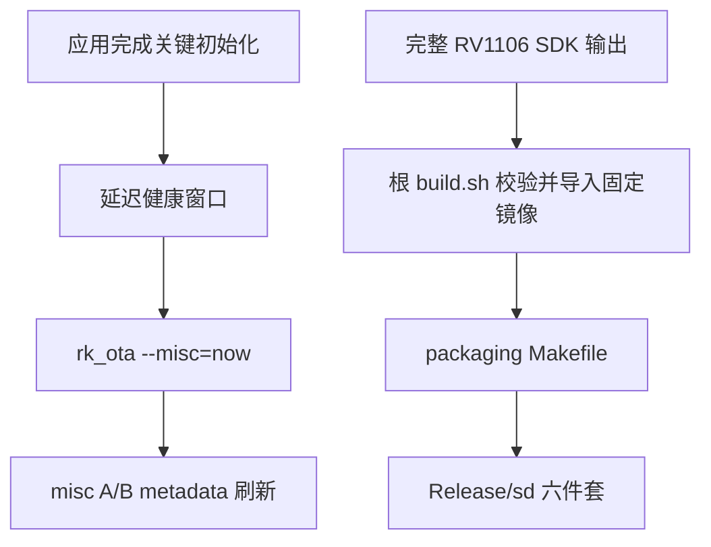

# 技术设计: RV1106 A/B 健康确认与 SD 固定镜像交付

## 技术方案

### 方案取舍
- **采用:** 应用关键初始化完成后启动延迟确认线程；根构建从显式 SDK 根目录导入固定镜像；Makefile 强制发布六件套。
- **修正:** 不在 `.env.txt` 中保存默认槽位，槽位状态继续由 `misc` 的 `AvbABData` 管理。
- **拒绝/暂缓:** 不采用启动脚本立即确认，避免系统尚未完成应用初始化就失去回滚机会；不继续静默复用仓库内旧固定镜像。

### 核心技术
- C++11 `fork/execv/waitpid` 无 shell 调用。
- GCC 原子锁复用现有 OTA 并发保护。
- Bash 显式 SDK 产物导入与文本/大小校验。
- GNU Make 六件套统一变量。

### 实现要点
- 抽取 `rk_ota` 子进程执行函数，升级与健康确认共享退出状态检查。
- 正常模式完成 `VideoInit()` 后启动线程，延迟 30 秒并有限重试 `--misc=now`。
- `RV1106_SDK_DIR` 必须指向已应用当前补丁且执行过 `./build.sh uboot`、`./build.sh env` 的 SDK，三个固定镜像统一从 `output/image/` 导入。
- 直接从 `env.img` 二进制校验 256 KiB 大小、U-Boot 小端 CRC32、A/B `mtdparts`、`sys_bootargs` 和 `sd_parts`；`.env.txt` 会被后续构建目标重新写成一行，不能作为最终 ENV 是否完整的唯一依据。

## 架构设计

## 架构决策 ADR

### ADR-20260730-AB-HEALTH: 槽位状态留在 misc，应用延迟确认
**上下文:** ENV 固定槽变量会在写入 `env.img` 时重置运行槽；现场又证明启动尝试次数没有刷新。
**决策:** 保持 `misc` 为槽位唯一来源，在应用关键初始化后延迟调用 SDK 健康确认命令。
**理由:** 保留 A/B 回滚语义，同时覆盖正常运行后尝试次数持续耗尽的问题。
**替代方案:** ENV 固定 `_a` → 拒绝原因: 会破坏动态切槽；init 脚本立即确认 → 拒绝原因: 健康门槛过低。
**影响:** 正常模式新增一个短生命周期线程和一次 `misc` 小数据写入。

## 安全与性能
- **安全:** 不使用 shell；固定参数；与 OTA 写入共享锁；SDK 路径与文件必须存在且为普通文件。
- **性能:** 启动后仅执行一次短命子进程，失败最多有限重试；镜像校验只发生在主机构建阶段。

## 测试与部署
- **测试:** 扩展 OTA 包装层 harness，验证 `--misc=now` 参数、退出码和无 shell；增加构建/Makefile 六件套与 SDK 导入策略断言；运行现有 RV1106 OTA/SD 策略测试。
- **部署:** 在完整 SDK 先执行 `./build.sh uboot`、再执行 `./build.sh env`，然后通过 `RV1106_SDK_DIR=/path/to/RV1106_IPC_SDK ./build.sh all` 生成发布物。
