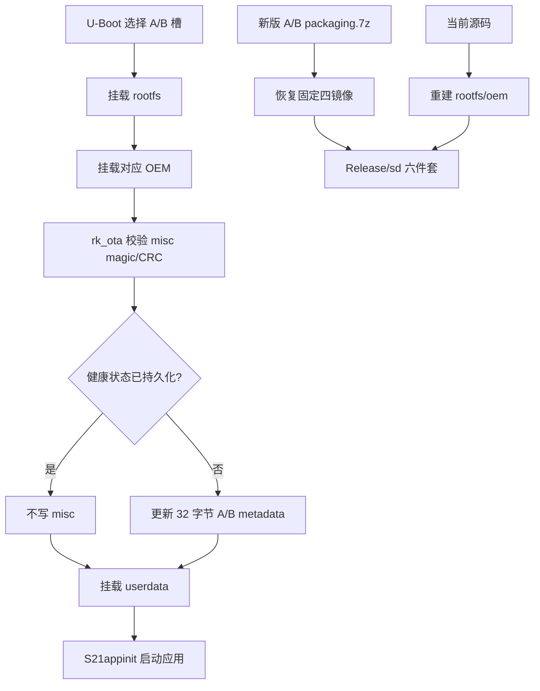

# 技术设计: RV1106 A/B 健康确认与 SD 固定镜像交付

## 技术方案

### 方案取舍
- **采用:** OEM 挂载成功后由 `S20linkmount` 同步确认健康；固定启动镜像由新版 A/B `packaging.7z` 提供；`rk_ota` 通过 magic/CRC 和状态比较实现失败保护与幂等写入。
- **修正:** `.env.txt` 不作为发布输入；不再要求 `RV1106_SDK_DIR` 或强制使用 SDK 最新启动镜像；不再由应用延迟线程确认。
- **拒绝/暂缓:** 不在 ENV 保存默认槽位；不周期性重写 misc；不把 env/idblock/uboot 放入网络 OTA。

### 核心技术
- BusyBox init 脚本同步健康门禁。
- AVB A/B 32 字节 metadata 的 magic、CRC32、priority、tries、successful 和 last_boot 校验。
- py7zr 固定成员恢复和发布前镜像验证。
- GNU Make SD 六件套一致性检查。

### 实现要点
- `S20linkmount` 顺序固定为 rootfs → OEM → `rk_ota --misc=now` → userdata；任一步失败均不进入应用启动。
- `setSlotSucceed()` 在槽选择前校验 magic 和 CRC；健康槽写为 `priority=15、successful_boot=1、tries_remaining=0、last_boot=当前槽`。
- 若上述字段已经一致，直接返回 0，不触发 MTD 全分区读改写。
- 根 `build.sh` 从 `packaging.7z` 只恢复 `env.img/idblock.img/uboot.img/boot.img`，再构建当前 `rootfs.img/oem.img`。
- 直接校验 `env.img` 的 256 KiB 大小、小端 CRC32、A/B `mtdparts`、`sys_bootargs` 和 `sd_parts`；`.env.txt` 不参与判断。
- 重新生成归档时保留 `/etc/iqfiles`、`/etc/mtab`、`/etc/os-release`、`/etc/resolv.conf` 等面向运行时目标的断链符号链接，不加入空目标占位。

## 架构设计

## 架构决策 ADR

### ADR-20260730-AB-HEALTH: OEM 挂载后确认，固定镜像来自归档
**上下文:** ENV 固定槽变量会破坏动态切槽；现场尝试次数没有刷新；SDK 最新输出不一定是本产品已验证启动链。
**决策:** 槽位状态继续只存 misc；OEM 挂载成功即执行同步健康确认；固定启动镜像由受版本控制的 A/B `packaging.7z` 提供。
**理由:** 缩小启动链变更面，确保应用启动前完成健康持久化，并避免正常每次开机重复擦写 misc。
**替代方案:** ENV 固定 `_a`、应用延迟确认、强制 SDK 最新镜像均因破坏切槽语义、确认过晚或引入未验证启动镜像而拒绝。
**影响:** OEM 挂载成功即视为升级完成；应用后续故障不再触发 A/B 自动回滚。

## 安全与性能
- **安全:** 固定命令和绝对路径；工具缺失、命令失败、magic/CRC 损坏均阻断后续启动；网络 OTA 仍只接受 boot/rootfs/oem。
- **性能:** 首次健康确认发生一次 misc 读改写；后续启动只读取并比较 32 字节 metadata，不再擦写 misc。

## 测试与部署
- **测试:** patch series 零 fuzz 应用；启动脚本调用顺序、应用层无重复调用、ENV CRC/A/B 内容、固定归档来源、SD 六件套、rk_ota magic/CRC/成功标志/幂等路径回归。
- **部署:** 直接执行根 `build.sh`；无需 `RV1106_SDK_DIR`。发布前核对 `packaging.7z` 固定镜像哈希和 ARM/uClibc `rk_ota`，再验证板端首次确认后第二次启动无 misc 写入日志。
