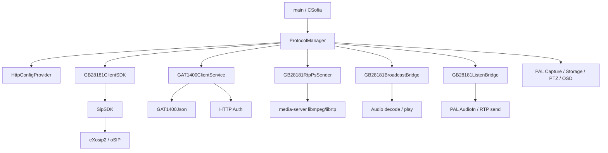
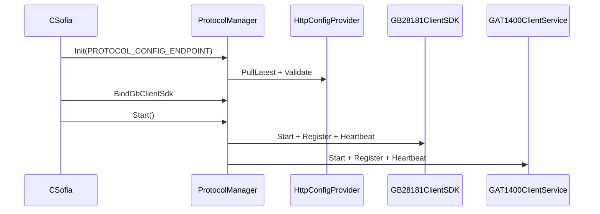

# 架构设计

## 总体架构

## 技术栈
- 核心: C/C++、CMake、POSIX 线程、Linux Socket
- 媒体: Rockchip MPP、PAL、FFmpeg、media-server
- 协议: GB28181 基于移植后的 GB28181SDK + SipSDK + eXosip/oSIP；GAT1400 基于应用内自实现客户端服务 + 复用平台 1400 结构与 JSON 组件

## 核心流程

## 分层说明

### 1. 启动与编排层
- `App/Main.cpp` 负责设备主流程
- `App/Protocol/ProtocolManager.*` 负责协议统一编排、配置加载、会话管理

### 2. 协议桥接层
- `App/Protocol/gb28181/*` 负责把 RK 媒体、音频、存储、控制能力映射到 GB28181 交互
- `App/Protocol/gat1400/GAT1400ClientService.*` 负责 GAT1400/VIID HTTP 客户端与订阅服务

### 3. SDK / 第三方层
- `third_party/platform_sdk_port/CommonLibSrc/GB28181SDK/*`
- `third_party/platform_sdk_port/CommonLibSrc/SipSDK/*`
- `third_party/platform_sdk_port/CommonLibSrc/GAT1400SDK/*`
- `third_party/gb_sip/install` 与 `third_party/gb_sip/src/*`

## 关键架构约束
- 协议配置依赖本地 HTTP 配置服务，但 GB28181 / GAT1400 注册核心参数允许通过 `/userdata/conf/Config/GB/gb28181.ini` 与 `/userdata/conf/Config/GB/gat1400.ini` 落盘并在配置服务不可达时回退使用；当前不再兼容旧的 `/userdata/conf/Config/gb28181.ini`。
- GB28181 实时流与回放 / 下载共用 `GB28181RtpPsSender`，属于强耦合发送通道。
- GB28181 对讲与广播现在使用独立运行态会话；`ACK` 到达前仅记录协商结果，不应提前建链发流。
- GAT1400 在应用内自建 HTTP 服务监听订阅端口，而不是单纯调用外部 SDK 黑盒；`GetTime()/GET_SYNCTIME` 当前已禁用为 no-op，设备时间统一由 GB28181 校时链路负责。
- GB28181 设备控制直接下钻 PTZ、OSD、图像翻转、升级和重启能力，协议层和设备能力耦合较深。

## 重大架构决策
完整的 ADR 存储在各变更的 `how.md` 中，本章节提供索引。

| adr_id | title | date | status | affected_modules | details |
|--------|-------|------|--------|------------------|---------|
| ADR-INIT-KB | 建立首版协议知识库，按代码事实描述 GB28181/GAT1400 架构 | 2026-03-12 | ✅已采纳 | BuildRuntime, GB28181, GAT1400 | 无单独方案包 |
| ADR-20260316-issue27 | GB 实时流 TCP 协商在 ACK 后再建立媒体连接 | 2026-03-16 | ✅已采纳 | ProtocolManager, GB28181RtpPsSender | [202603161102_issue27_gb_live_tcp](../history/2026-03/202603161102_issue27_gb_live_tcp/how.md) |
| ADR-20260320-issue31 | GB28181 接入参数改为本地文件优先并支持禁用开关 | 2026-03-20 | ✅已采纳 | LocalConfigProvider, HttpConfigProvider, ProtocolManager | [202603201017_issue31_gb_local_config](../history/2026-03/202603201017_issue31_gb_local_config/how.md) |
| ADR-20260320-broadcast | 广播按 `Notify -> Broadcast MESSAGE -> 设备主动 Talk INVITE` 重组为 2022 版流程 | 2026-03-20 | ✅已采纳 | ProtocolManager, GB28181BroadcastBridge, SIP stack | [202603201644_gb_broadcast_2022_alignment](../history/2026-03/202603201644_gb_broadcast_2022_alignment/how.md) |
| ADR-20260324-issue38 | GB 注册配置收口到本地 `gb28181.ini`，仅保留 6 个外部可编辑字段 | 2026-03-24 | ✅已采纳 | LocalConfigProvider, ProtocolManager, config API | [202603241352_issue38_gb_config_simplify](../history/2026-03/202603241352_issue38_gb_config_simplify/how.md) |
| ADR-20260325-issue38-gb-gat-config | 本地注册配置迁移到 `/userdata/conf/Config/GB/*`，并为 GAT1400 增加独立 flash 配置与显式重载接口 | 2026-03-25 | ✅已采纳 | LocalConfigProvider, ProtocolManager, config API | [202603251207_issue38_gb_gat_config_split](../history/2026-03/202603251207_issue38_gb_gat_config_split/how.md) |
| ADR-20260324-gat-time | GAT1400 主动校时停用，设备时间同步统一交给 GB28181 | 2026-03-24 | ✅已采纳 | GAT1400ClientService, ProtocolManager | [202603241926_gat_disable_time_sync](../history/2026-03/202603241926_gat_disable_time_sync/how.md) |
