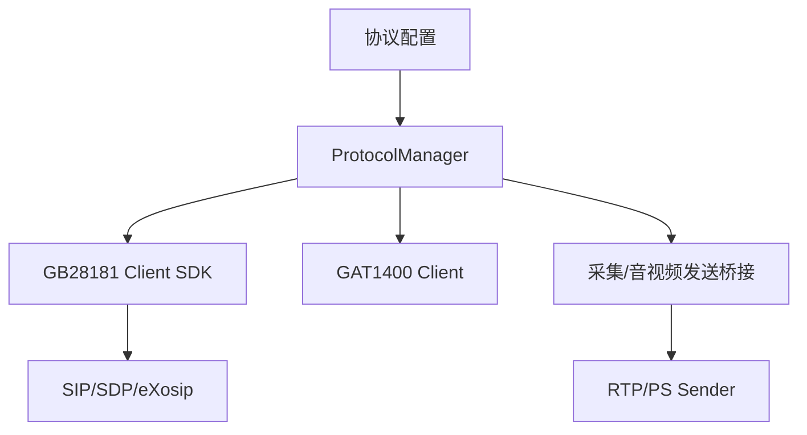
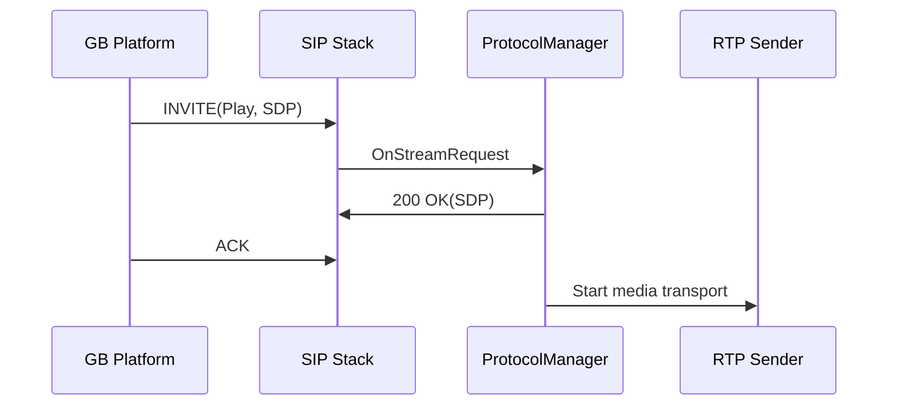

# 架构设计

## 总体架构

## 技术栈
- 后端: C/C++
- 构建: CMake + 交叉编译工具链
- 媒体: RK 采集接口 + RTP/PS 封装

## 核心流程

## 重大架构决策

| adr_id | title | date | status | affected_modules | details |
|--------|-------|------|--------|------------------|---------|
| ADR-20260316-issue27 | GB 实时流 TCP 协商在 ACK 后再建立媒体连接 | 2026-03-16 | ✅已采纳 | ProtocolManager, GB28181RtpPsSender | [history/2026-03/202603161102_issue27_gb_live_tcp/how.md](../history/2026-03/202603161102_issue27_gb_live_tcp/how.md) |
